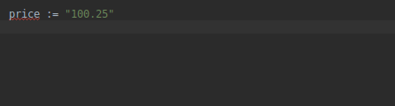
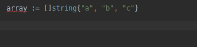

### Live templates and shortcurts for Goland IDE

####Usage:

File -> Import Settings -> Select the file goland-settings.zip

### Live templates:

##### a =>create and array

##### atof => Convert string to float

##### a => Convert string to int

##### defe => Defer to close write/reader

##### en => Create a very common if err != null

##### fori => for loop (index)

##### fore => for loop (foreach)

##### i => New interface

##### st => New struct

##### json => Create json tags (And bson)

##Shortcuts
Most shortcuts are triggered by shift + alt

####Window and tabs

shift+alt+6(Num KB)  => Split (move) right 

  

shift+alt+2(Num KB) => Split (move) down   

shift+alt+(left/right) => Open left/right tab 

 

####Git

shift+alt+c => Push   
shift+alt+f => Fetch  
shift+alt+c => Commit 
